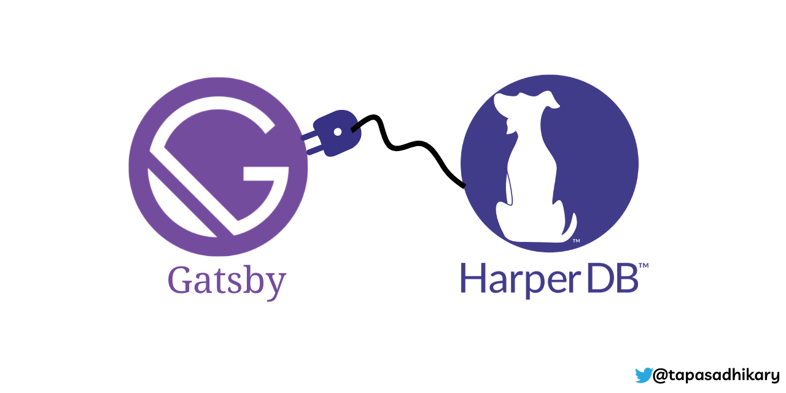

# gatsby-source-harperdb

<p align="center">
    
</p>

## Description

[HarperDB](https://harperdb.io/) is a fast, flexible database that allows you to perform rapid application development, distributed computing, SaaS, and many more. On the other hand, [Gatsbyjs](https://www.gatsbyjs.com/) is a React-based framework that allows you to build fast, secure, and robust websites.

Gatsby's massive plugin ecosystem allows us to pull data from several data sources, avail themes, and many more use-cases. The `gatsby-source-harperdb` plugin allows you to use the `HarperDB` as the data source so that a Gatsby project can pull the data at the build time.

It will help any `Gatsbyjs` app to create a prebuilt markup with the data from `HarperDB`.

### Learning Resources (optional)

Here a few learning resources you may find helpful,

- [Getting started with HarperDB](https://studio.harperdb.io/sign-up)
- [How Gatsby Works?](https://www.gatsbyjs.com/how-it-works/)

## How to install

To install the plugin for your Gatsby project, use this command,

```shell
npm install

# If you are using yarn, try this,
# yarn install
```

Please note: `Gatsby` documentation uses `npm` for installation. It is the recommended approach for plugins as well. However, my test with `yarn` also went well.
## When do I use this plugin?

You would use this plugin when you want to fetch data from the `HarperDB` in advance at the build time. The `gatsby build` command will build the project and create prebuilt markups along with the data. Thus, it will make the initial page load of your application faster. The bonus is, you achieve `Jamstack` as well.

> Please note: To get the dynamic data at a later point of time from the `HarperDB`, you need to perform regular calls using `axios`, `node-fetch`, etc.
## Examples of usage
In your Gatsbyjs project, make an entry in the `plugins` array in the `gatsby-config.js` file.

```js
plugins: [
    ...
    {
      resolve: `gatsby-source-harperdb`,
      options: {
        secret: "_YOUR_HARPERDB_SECRET_KEY_",
        url: "_YOUR_HARPERDB_URL_",
        payload: {
          "operation": "sql",
          "sql":"SELECT * FROM library.book"
        },
        type: "books"
      },
    },
  ],
```
The options are,
- `secret`: Provide the `HarperDB` secret key. After setting up an instance on HarperDB, you can find it in the `example code` section. We use this secret key in the `Authorization` header.
- `url`: The URL to connect to the HarperDB instance. For example, if you have created an instance on the cloud, you may have got a URL like, `https://xxxxxx.harperdbcloud.com`
- `payload`: Here, you pass the type of operation and the query to perform on the HarperDB database. In most cases, you would use a `SELECT` query here. You can also pass a query using joins.
- `type`: It can be any string of your choice. It is the name under which your data will appear in Gatsby GraphQL queries. For example, if we specify `books` as the type name, Gatsby will create GraphQL queries as `allBooks` and `books`.

## How to query for data

To query the data use GraphQL query like this,

```gql
query MyQuery {
  allBooks {
    nodes {
      rating
      publisher
    }
  }
}
```
It will return the rating and the publisher name of all the books in the database.

```json
{
  "data": {
    "allBooks": {
      "nodes": [
        {
          "rating": 0,
          "publisher": "Manning"
        },
        {
          "rating": 0,
          "publisher": "O'Reilly Media"
        },
        {
          "rating": 0,
          "publisher": "No Starch Press"
        },
        {
          "rating": 0,
          "publisher": "O'Reilly Media"
        },
        {
          "rating": 0,
          "publisher": "O'Reilly Media"
        },
        {
          "rating": 4.5,
          "publisher": "No Starch Press"
        },
        {
          "rating": 4,
          "publisher": "O'Reilly Media"
        },
        {
          "rating": 5,
          "publisher": "O'Reilly Media"
        }
      ]
    }
  },
  "extensions": {}
}
```
How about applying a filter? Let's query the books with a rating of more than 4.

```gql
query MyQuery {
  allBooks(filter: {rating: {gt: 4}}) {
    nodes {
      rating
      title
    }
  }
}
```
It will output,

```json
{
  "data": {
    "allBooks": {
      "nodes": [
        {
          "rating": 4.5,
          "title": "Understanding ECMAScript 6"
        },
        {
          "rating": 5,
          "title": "You Don't Know JS"
        }
      ]
    }
  },
  "extensions": {}
}
```
Now, you can use queries like these in the Gatsbyjs pages and components.
## How to contribute

Thank you for using `gatsby-source-harperdb,` and I hope you find it helpful. If you face any issues or got an enhancement request, please consider logging the [issue](https://github.com/atapas/gatsby-source-harperdb/issues) or opening a [pull request](https://github.com/atapas/gatsby-source-harperdb/pulls). All contributions are welcome.